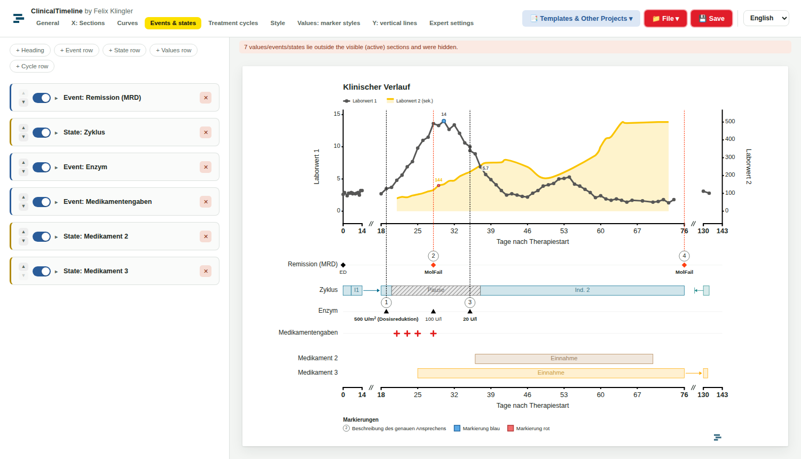
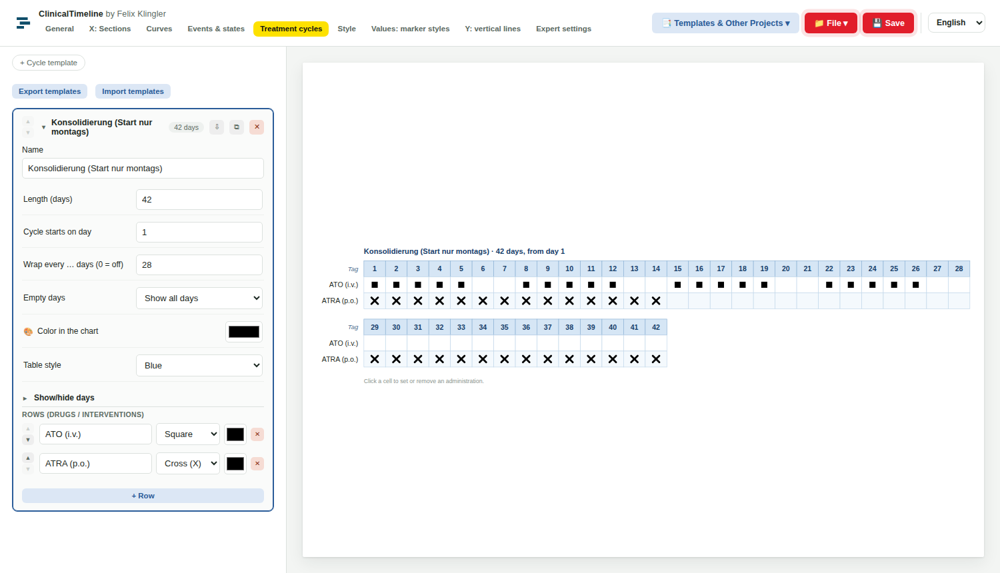
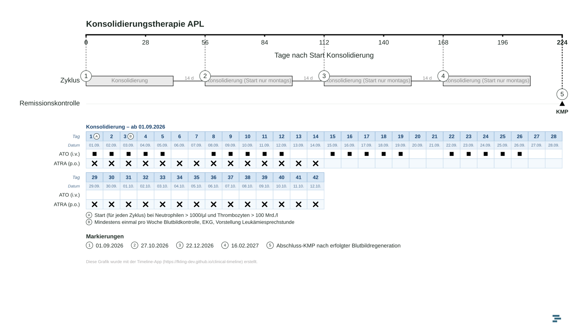
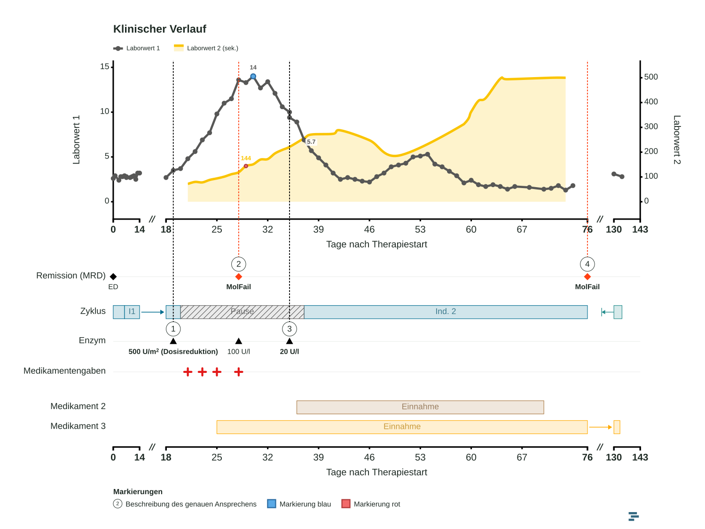

# ClinicalTimeline

**Clinical course charts and treatment schedules in the browser – from data to a presentation-ready figure.**
By Felix Klingler (supported by Claude Sonnet 5.5) · [Deutsche Version](README.de.md)

ClinicalTimeline turns a patient or treatment course into a clean, publication-style figure: laboratory curves, events, states (e.g. treatment phases), drug administrations, and chemotherapy cycle tables on one time axis. Everything runs locally in your browser – no server, no account, no installation.

**Live app:** <https://fkling-dev.github.io/clinical-timeline>

| Try an example directly | Link |
|---|---|
| Clinical course chart (curves, events, states) | [`?preview=1`](https://fkling-dev.github.io/clinical-timeline/?preview=1) |
| Treatment plan course (cycles + cycle table) | [`?preview=2`](https://fkling-dev.github.io/clinical-timeline/?preview=2) |



---

## Contents

- [Highlights](#highlights)
- [Quick start](#quick-start)
- [The interface at a glance](#the-interface-at-a-glance)
- [Tab reference](#tab-reference)
- [Working directly in the chart](#working-directly-in-the-chart)
- [Treatment cycles in detail](#treatment-cycles-in-detail)
- [Export, saving and files](#export-saving-and-files)
- [Templates, examples and links](#templates-examples-and-links)
- [Interface language](#interface-language)
- [Privacy and data](#privacy-and-data)
- [Browser support](#browser-support)
- [Project structure and deployment](#project-structure-and-deployment)
- [Customizing and extending](#customizing-and-extending)
- [Troubleshooting](#troubleshooting)
- [Disclaimer and license](#disclaimer-and-license)

---

## Highlights

- **One time axis, built from sections.** Split the X axis into sections (e.g. induction / consolidation / follow-up) with their own tick steps and relative widths. Gaps between sections are marked with a break symbol (`//`), so long follow-up periods stay readable.
- **Curves with two Y axes.** Lines, markers, lines + markers or an area under the curve (AUC); smoothing; per-point value labels and per-point marker styles.
- **Rows for everything else.** Headings, event rows (symbols with labels), state rows (colored boxes, optionally hatched), value rows (numbers such as drug levels) and cycle rows.
- **Numbered markers.** Highlight an event, a state boundary or a date: the app draws a numbered circle, a dashed guide line up to the chart, and an entry in the marker list below.
- **Treatment cycles and cycle tables.** Define cycle templates (days × drugs/interventions), click cells to mark administrations, place cycles on the time axis and show the schedule as a table below the chart – with wrapping, hidden days, absolute dates and day comments.
- **Exact page format.** Choose an aspect ratio (16:9, 4:3, …); the figure always matches it. Content that is too tall is scaled as a whole instead of changing the format.
- **Export that is actually reusable.** SVG (Scalable Vector Graphics), PNG (Portable Network Graphics) and **editable PowerPoint** (native shapes and text boxes, not a flat picture).
- **Reusable styles and templates.** Export/import the visual style, marker templates and cycle templates as JSON (JavaScript Object Notation) files.
- **English and German interface.**

## Quick start

1. Open the [live app](https://fkling-dev.github.io/clinical-timeline) (or an [example](https://fkling-dev.github.io/clinical-timeline/?preview=1)).
2. Start with **Load example data** or **Start your own chart**.
3. Work through the tabs from left to right: **General** → **X: Sections** → **Curves** → **Events & states** → optionally **Treatment cycles**.
4. Fine-tune the look under **Style**.
5. Save the project (**Save**) and export the figure via **File ▾ → Export …**.

Tip: the preview on the right is the real figure. Many things can be changed by **clicking directly in it** (see [Working directly in the chart](#working-directly-in-the-chart)).

## The interface at a glance

- **Header:** app name, the tab bar, **Templates & Other Projects ▾**, **File ▾**, **Save** and the language selector.
- **Left panel:** the settings of the selected tab. Most settings sit on one line (label left, control right). Add buttons (`+ …`) are at the top or bottom of a list.
- **Right panel:** the live preview of the figure. In the tab **Treatment cycles** the preview shows the selected cycle template as a clickable table instead.



## Tab reference

### General
Chart title, X-axis label, Y-axis labels (primary/secondary), file name for saving and exports, **aspect ratio** (width × height with presets 16:9, 4:3, 1:1, 21:9, portrait 3:4), footer text and **Reset to example data**.

### X: Sections
- **Date of the X axis (master option):** assign a calendar date to one day of the axis (default: the beginning of the X axis). Once set, the start dates of all treatment cycles are calculated from it and their own date field is greyed out.
- **Sections:** label, from day, to day, tick step and relative width. Sections can be switched off. Overlapping or invalid sections are highlighted in red and not drawn until fixed. Values, events or states that lie outside all visible sections are hidden (a warning tells you how many).

### Curves
- Display mode: *Line + markers*, *Markers only*, *Line only*, *AUC curve (area)*.
- Color, line width, area color and opacity, symbol and size, smooth curve, primary/secondary axis.
- Measurements as a day/value table. **Paste from Excel** replaces all values from two copied columns.
- Symbols: circle, square, triangle, diamond, star, cross (X), double cross (XX), plus.

### Events & states
Rows are added with `+ Heading`, `+ Event row`, `+ State row`, `+ Values row` and `+ Cycle row`; they can be reordered (▲▼), hidden (switch) or deleted.

| Row type | What it shows |
|---|---|
| **Heading** | A group title (bold and underlined by default). |
| **Event** | A symbol per day with a label below. An entry can be *highlighted*: it then gets a numbered marker (circle, guide line, entry in the marker list). |
| **State** | Colored boxes from start to end (e.g. inpatient stay, drug intake), optionally hatched, with a label. A box that spans a gap between sections is connected with an arrow. Boxes can carry marks at start, end or any day. Overlapping states in the same row are flagged. |
| **Values** | Numbers placed at days (e.g. enzyme levels) with unit, decimals, bold/color; overlapping texts can be staggered. |
| **Cycle** | Treatment cycles placed on the time axis – see [below](#treatment-cycles-in-detail). |

**Box beyond section:** if a state starts earlier or ends later than the visible section but does not reach the neighbouring section, you can mark the cut end: *no indicator*, *two triangles inside*, *two triangles outside*, *whisker* (a line to the true end in the gap) or *arrow with bar*.

### Treatment cycles
Create cycle templates and edit them as a clickable table. See [Treatment cycles in detail](#treatment-cycles-in-detail).

### Style
Settings that only affect the appearance (not the data):

- Title alignment, legend, grid lines, font size scaling.
- Axis texts and axis label style, spacing between axis, section labels and rows; second X axis at the bottom; zero-line alignment of both Y axes; automatic or manual value ranges of both Y axes.
- Row labels, group headings, event/state rows, grid in the rows area, state boxes, *box beyond section*.
- **Cycle tables:** text size and spacing.
- **Markers:** line width, number-symbol size, list layout (one marker per line or running), spacing, left alignment.
- **Footnote:** size, color, alignment, spacing.
- Each of the big areas (**Chart, Events and states, Cycle tables, Markers, Footnote**) can be switched on or off as a whole.
- **Export style / Import style:** save the complete look as a JSON file and apply it to other charts. Curve colors are transferred by curve name (falling back to order).

### Values: marker styles
Marker styles change how individual data points look (fill, border, border width) and can have a label that appears in the marker list.

- Four **base templates** (blue, green, red, purple) are provided; you can create your own.
- Templates are stored in the project. They can be **exported and imported** as JSON; imported templates appear under the file name and every group can be collapsed.
- Apply a style by clicking a data point in the chart.

### Y: vertical lines
Reference lines at fixed Y values (drawn horizontally across the chart), e.g. thresholds or targets: Y value, primary/secondary axis, color, line style (solid, dashed, dotted, dash-dot), width, label and label size.

### Expert settings
Rarely needed fine-tuning: **export resolution** (width in px for SVG/PNG), file name prefixes, watermark icon, and detailed spacing/size settings. Apart from the file name prefixes and the export resolution they are part of the style and are included in *Export style*.

## Working directly in the chart

Click elements in the preview to edit them in place:

| Click on … | You can … |
|---|---|
| a curve point | show its value; choose a marker style |
| an event | change symbol color or label; highlight it (numbered marker) |
| a state box | switch hatching; add or remove marker lines (with label) at the start, the end or any day |
| a value | highlight it, change color or label |
| a cycle box / cycle symbol | switch *Show pause until the next cycle*, *Show cycle table below*, edit the start date, show absolute dates, and show the **start / day X / end date as a marker** |
| a day in a cycle table | add a comment (shown as a circled letter next to the day and as text below the table) |

## Treatment cycles in detail

### 1. Cycle templates (tab *Treatment cycles*)
A template is a schedule of days × rows (drugs or interventions):

- **Name, length (days), "cycle starts on day"** (e.g. 1, or −2 for protocols with pre-phase days).
- **Wrap every … days:** long cycles are broken into blocks (e.g. every 7 or 14 days), each block repeating the header and rows.
- **Empty days:** show all days, hide empty days, or collapse empty days into a `//` column.
- **Show/hide days:** deselect individual days (e.g. a protocol with days −2, −1, 1, 2 but no day 0). Deselected days do not exist – they are skipped in dates and in the cycle duration.
- **Color** (cycle box in the chart) and **table style** (neutral gray, blue, red, green – a complete table color scheme).
- **Rows:** name, symbol (e.g. cross X, square, double cross XX for twice-daily use), color (default black); reorder, add, delete.
- **Click a cell in the preview** to set or remove an administration.
- Templates can be duplicated, reordered and **exported/imported** as JSON (all templates or a single one).

### 2. Cycle rows (tab *Events & states* → `+ Cycle row`)
A cycle row places several cycles on the time axis. Each cycle has: template, **start day in the chart**, optional **start date** (greyed out when the master date of the X axis is set), label, color, and:

- **Display of the row:** *Box over the cycle duration* or *Marker symbol at the start*.
- **Show pause until the next cycle:** a line from the end of the cycle to the start of the next one with the number of days in between (e.g. "14 d").
- **Show table below:** draws the cycle table under the rows area (above the marker list). With a date, **absolute dates** can be shown under the day numbers.
- **Show date as marker:** start date, a chosen day, or end date as a numbered marker.

### 3. Day comments
Click the day number in a cycle table to add a comment, for example a start condition. The day then shows a circled letter (A, B, C …) next to its number and the comment appears below the table with the same circle.



## Export, saving and files

**File ▾** menu:

| Action | Result |
|---|---|
| Open | Load a project file (`.json`). |
| Save as … | Save the project under a new name. |
| Export SVG | Vector graphic. |
| Export PNG | Raster image rendered at twice the export width (default 2000 px → 4000 px). |
| Export PowerPoint | A slide 13.33 in wide; its height follows the chosen aspect ratio. Curves, boxes, texts, tables and markers are **native, editable PowerPoint objects**. |

**Save** writes directly into the opened project file where the browser supports it (Chrome/Edge); otherwise the project is downloaded as a file.

File names are built from a prefix, the file name (**General**), and a time stamp, e.g. `TIMELINE-GRAFIK # My course # 2026-10-03 # 14-30.png`. Prefixes can be changed in **Expert settings**.



Other files you can save and load (JSON): **style** (Style tab), **marker templates** (Values: marker styles), **cycle templates** (Treatment cycles).

**Format note:** the chosen aspect ratio is always exact. If the content needs more height than the ratio allows at the standard width, the whole figure is scaled down and centered instead of stretching the page.

## Templates, examples and links

- **Templates & Other Projects ▾** (top right) loads the built-in chart templates *Clinical course chart* and *Treatment plan course*. Loading replaces the current chart (you are asked first if there are unsaved changes).
- **Links to examples** without any server component: add a query parameter to the URL.

  | URL | Opens |
  |---|---|
  | `…/clinical-timeline/` | the start page |
  | `…/clinical-timeline/?preview=1` | Clinical course chart |
  | `…/clinical-timeline/?preview=2` | Treatment plan course |

  A missing or unknown value simply shows the start page.
- **Other projects:** the same menu can list links to other projects. They are defined in [`menu-links.js`](menu-links.js) (name + link, opens in a new tab); see [Customizing](#customizing-and-extending).

## Interface language

Choose **English** or **Deutsch** at the top right. English is the default; the choice is remembered in the browser. Only the interface is translated – the contents of your chart (titles, labels, data) and a few fixed words inside the figure (e.g. "Markierungen", "Tag", "Datum") are not.

## Privacy and data

- All processing happens **in your browser**. Charts and data are not uploaded anywhere; there is no tracking or account.
- The only value kept in the browser is the interface language (local storage). Projects are saved only where you save them.
- The page loads two external resources: web fonts from Google Fonts (IBM Plex Sans, IBM Plex Mono, Carlito) and the PptxGenJS library from the jsDelivr content delivery network (CDN) for the PowerPoint export. Without internet access the app still works, but the PowerPoint export is unavailable and the fonts fall back to system fonts. For a fully offline or strictly self-contained setup, host these files yourself.
- **Do not enter data that identifies patients unless this is permitted by your institution's rules.** Pseudonymized or fictional data is recommended for figures.

## Browser support

Developed and tested with Chromium-based browsers (Chrome, Edge). Other current browsers (Firefox, Safari) should work as well but have not been tested in the same depth. Saving straight into the opened file needs the File System Access API (application programming interface), which only Chrome and Edge provide; in other browsers *Save* downloads the file.

## Project structure and deployment

ClinicalTimeline is a static web app – no build step, no dependencies to install.

| File | Purpose |
|---|---|
| `index.html` | Page, styles, header; loads the scripts. |
| `app.js` | Data model, layout engine, SVG/PNG/PowerPoint export, built-in templates. |
| `ui.js` | Interface: tabs, panels, popovers, file handling. |
| `i18n.js` | English translations of the interface. |
| `menu-links.js` | Optional extra menu entries (name + link). |
| `docs/` | Images used in this documentation. |

**Deployment (GitHub Pages):** put all files in the repository root (or a folder), enable *Settings → Pages*, and open the published address. The app can also be opened directly from the file system (`index.html`); everything works there as well.

## Customizing and extending

**Add menu links** – edit `menu-links.js`:

```js
const EXTRA_MENU_LINKS = [
  { name: 'My other project', url: 'https://example.com/' },
];
```

Only `http://` and `https://` links are accepted; they open in a new tab. If the list is empty (or the file is missing), no section is shown.

**Add a chart template** – in `app.js`:

1. Build and save a chart in the app (**Save**), then paste the file's content as a new constant (like `THERAPY_PLAN_TEMPLATE`).
2. Add an entry to `CHART_TEMPLATES` (`id`, `name`, `build`). It appears in the *Templates* menu and is available as `?preview=N` (N = position in the list, starting at 1).
3. Add an English name to `i18n.js` if you want it translated.

**Add or change translations** – `i18n.js` maps the German source text of the interface to English. Texts with numbers or names are handled by the pattern list at the end of the file. Missing entries stay German.

**Project file format** – projects are plain JSON. The main keys are `title`, axis labels, `aspectW`/`aspectH`, `segments`, `series` (with `points`), `rows` (kinds `header`, `event`, `state`, `values`, `cycle`), `markStyles`, `cycleTemplates`, `yRefLines`, `masterDate`/`masterDay` and the style settings. Missing keys are filled with defaults when a file is opened, so older files keep working.

## Troubleshooting

| Problem | Solution |
|---|---|
| PowerPoint export does not start | The PptxGenJS library could not be loaded (no internet or blocked). PNG/SVG export is unaffected. |
| A warning says values were hidden | Some data lies outside all active sections (check **X: Sections**). |
| A section is shown in red | It overlaps another section or its end is not after its start. |
| *Save* downloads a file instead of overwriting | Your browser does not support direct file saving (use Chrome/Edge). |
| Everything is in German/English | Change the language selector at the top right. |
| The figure looks tiny in PowerPoint | A lot of content with a flat format (e.g. 16:9) is scaled down to fit. Use a taller format or fewer/narrower cycle tables. |

## Disclaimer and license

ClinicalTimeline is a visualization tool and **not a medical device**. Check all data and figures before using them in clinical, scientific or patient-facing contexts.

© Felix Klingler
